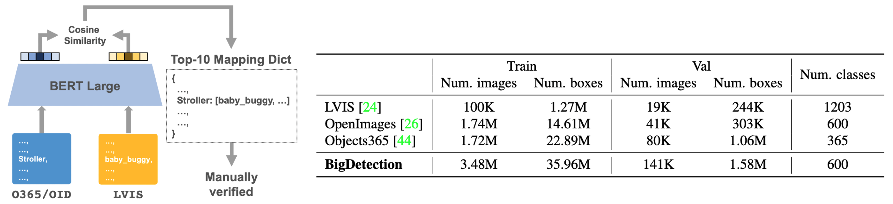
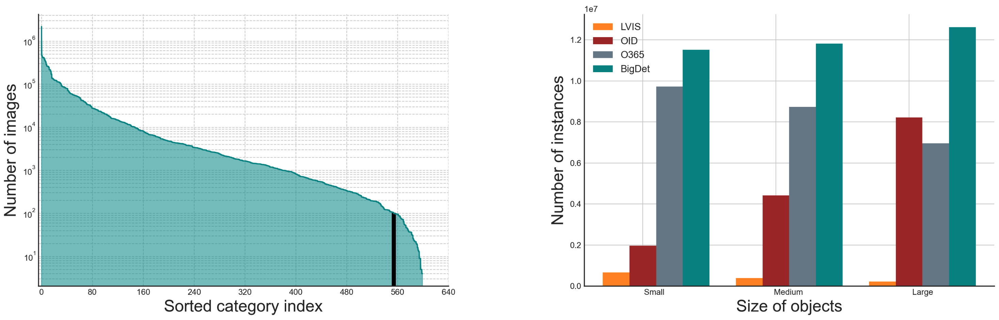

# BigDetection: A Large-scale Benchmark for Improved Object Detector Pre-training

By [Likun Cai](https://github.com/cailk), Zhi Zhang, Yi Zhu, Li Zhang, Mu Li, Xiangyang Xue.

<!-- <div align="center">
    
</div> -->


This repo is the official implementation of [BigDetection](https://arxiv.org/abs/2203.13249). It is based on [mmdetection](https://github.com/open-mmlab/mmdetection) and [CBNetV2](https://github.com/VDIGPKU/CBNetV2).

## Introduction
We construct a new large-scale benchmark termed *BigDetection*. Our goal is to simply leverage the training data from existing datasets ([LVIS](https://www.lvisdataset.org/), [OpenImages](https://storage.googleapis.com/openimages/web/index.html) and [Object365](https://www.objects365.org/overview.html)) with carefully designed principles, and curate a larger dataset for improved detector pre-training. BigDetection dataset has 600 object categories and contains 3.4M training images with 36M object bounding boxes. We show some important statistics of BigDetection in the following figure.


*Left*: Number of images per category of BigDetection. *Right*: Number of instances in different object sizes. 

## Results and Models

### BigDetection Validation
We show the evaluation results on BigDetection Validation. We hope BigDetection could serve as a new challenging benchmark for evaluating next-level object detection methods.

| Method | mAP (bigdet val) | Links |
| --- | :---: | :---: |
| YOLOv3 | 9.7 | [model](https://big-detection.s3.us-west-2.amazonaws.com/bigdet_cpts/mmdetection_cpts/yolov3_d53_bigdet_8x.pth)/[config](configs/BigDetection/yolov3/yolov3_d53_mstrain-608_8x_bigdet.py) |
| Deformable DETR | 13.1 | [model](https://big-detection.s3.us-west-2.amazonaws.com/bigdet_cpts/mmdetection_cpts/deformable_detr_bigdet_8x.pth)/[config](configs/BigDetection/deformable_detr/deformable_detr_r50_16x2_8x_bigdet.py) |
| Faster R-CNN (C4)\* | 18.9 | [model](https://big-detection.s3.us-west-2.amazonaws.com/bigdet_cpts/detectron2_cpts/faster_rcnn_r50_c4_bigdet_8x.pth) |
| Faster R-CNN (FPN)\* | 19.4 | [model](https://big-detection.s3.us-west-2.amazonaws.com/bigdet_cpts/detectron2_cpts/faster_rcnn_r50_fpn_bigdet_8x.pth) |
| CenterNet2\* | 23.1 | [model](https://big-detection.s3.us-west-2.amazonaws.com/bigdet_cpts/detectron2_cpts/centernet2_r50_bigdet_8x.pth) |
| Cascade R-CNN\* | 24.1 | [model](https://big-detection.s3.us-west-2.amazonaws.com/bigdet_cpts/detectron2_cpts/crcnn_r50_bigdet_8x.pth) |
| CBNetV2-Swin-Base | 35.1 | [model](https://big-detection.s3.us-west-2.amazonaws.com/bigdet_cpts/mmdetection_cpts/htc_cbv2_swin_base_giou_4conv1f_bigdet.pth)/[config](configs/BigDetection/cbnetv2/htc_cbv2_swin_base_giou_4conv1f_adamw_bigdet.py) |

### COCO Validation
We show the finetuning performance on COCO minival/test-dev. Results show that BigDetection pre-training provides significant benefits for different detector architectures. We achieve 59.8 mAP on COCO test-dev with a single model.

| Method | mAP (coco minival/test-dev) | Links |
| --- | :---: | :---: |
| YOLOv3 | 30.5/- | [config](configs/BigDetection/yolov3/yolov3_d53_mstrain-608_8x_bigdet.py) |
| Deformable DETR | 39.9/- | [model](https://big-detection.s3.us-west-2.amazonaws.com/bigdet_cpts/mmdetection_cpts/deformable_detr_bigdet_coco-ft_1x.pth)/[config](configs/BigDetection/deformable_detr/deformable_detr_r50_16x2_8x_bigdet.py) |
| Faster R-CNN (C4)\* | 38.8/- | [model](https://big-detection.s3.us-west-2.amazonaws.com/bigdet_cpts/detectron2_cpts/faster_rcnn_r50_c4_bigdet_coco-ft_1x.pth) |
| Faster R-CNN (FPN)\* | 40.5/- | [model](https://big-detection.s3.us-west-2.amazonaws.com/bigdet_cpts/detectron2_cpts/faster_rcnn_r50_fpn_bigdet_coco-ft_1x.pth) |
| CenterNet2\* | 45.3/- | [model](https://big-detection.s3.us-west-2.amazonaws.com/bigdet_cpts/detectron2_cpts/centernet2_r50_bigdet_coco-ft_1x.pth) |
| Cascade R-CNN\* | 45.1/- | [model](https://big-detection.s3.us-west-2.amazonaws.com/bigdet_cpts/detectron2_cpts/crcnn_r50_bigdet_coco-ft_1x.pth) |
| CBNetV2-Swin-Base | **59.1**/**59.5** | [model](https://big-detection.s3.us-west-2.amazonaws.com/bigdet_cpts/mmdetection_cpts/htc_cbv2_swin_base_giou_4conv1f_bigdet_coco-ft_20e.pth)/[config](configs/BigDetection/cbnetv2/htc_cbv2_swin_base_giou_4conv1f_adamw_bigdet.py) |
| CBNetV2-Swin-Base (TTA) | **59.5**/**59.8** | [config](configs/BigDetection/cbnetv2/htc_cbv2_swin_base_giou_4conv1f_adamw_bigdet.py) |

### Data Efficiency
We followed [STAC](https://arxiv.org/abs/2005.04757) and [SoftTeacher](https://arxiv.org/abs/2106.09018) to evaluate on COCO for different partial annotation settings.

| Method | mAP (1%) | mAP (2%) | mAP (5%) | mAP (10%) |
| --- | :---: | :---: | :---: | :---: |
| Baseline | 9.8 | 14.3 | 21.2 | 26.2 |
| STAC     | 14.0 | 18.3 | 24.4 | 28.6 |
| SoftTeacher (ICCV 21) | 20.5 | 26.5 | 30.7 | 34.0 |
| Ours | **25.3** | **28.1** | **31.9** | **34.1** |
|  | [model](https://big-detection.s3.us-west-2.amazonaws.com/bigdet_cpts/data_efficiency/faster_rcnn_r50_fpn_bigdet_coco-1.pth) | [model](https://big-detection.s3.us-west-2.amazonaws.com/bigdet_cpts/data_efficiency/faster_rcnn_r50_fpn_bigdet_coco-2.pth) | [model](https://big-detection.s3.us-west-2.amazonaws.com/bigdet_cpts/data_efficiency/faster_rcnn_r50_fpn_bigdet_coco-5.pth) | [model](https://big-detection.s3.us-west-2.amazonaws.com/bigdet_cpts/data_efficiency/faster_rcnn_r50_fpn_bigdet_coco-10.pth) |

### Notes
- The models following `*` are implemented on another detection codebase [Detectron2](https://github.com/facebookresearch/detectron2). Here we provide the pretrained checkpoints. The results can be reproduced following the installation of [CenterNet2](https://github.com/xingyizhou/CenterNet2) codebase.
- Most of models are trained for `8X` schedule on BigDetection.
- Most of pretrained models are finetuned for `1X` schedule on COCO.
- `TTA` denotes test time augmentation.
- Pre-trained models of Swin Transformer can be downloaded from [Swin Transformer for ImageNet Classification](https://github.com/microsoft/Swin-Transformer).

## Getting Started

### Requirements
- `Ubuntu 16.04`
- `CUDA 10.2`

### Installation
```
# Create conda environment
conda create -n bigdet python=3.7 -y
conda activate bigdet

# Install Pytorch
conda install pytorch==1.8.0 torchvision==0.9.0 cudatoolkit=10.2 -c pytorch

# Install mmcv
pip install mmcv-full==1.3.9 -f https://download.openmmlab.com/mmcv/dist/cu102/torch1.8.0/index.html

# Clone and install
git clone https://github.com/amazon-research/bigdetection.git
cd bigdetection
pip install -r requirements/build.txt
pip install -v -e .

# Install Apex (optinal)
git clone https://github.com/NVIDIA/apex
cd apex
pip install -v --disable-pip-version-check --no-cache-dir --global-option="--cpp_ext" --global-option="--cuda_ext" ./
```

### Data Preparation
Our BigDetection involves 3 datasets and train/val data can be downloaded from their official website ([Objects365](https://www.objects365.org/download.html), [OpenImages v6](https://storage.googleapis.com/openimages/web/download.html), [LVIS v1.0](https://www.lvisdataset.org/dataset)). All datasets should be placed under $bigdetection/data/ as below. The synsets (total 600 class names) of BigDetection dataset can be downloaded here: [bigdetection_synsets](https://drive.google.com/file/d/1XbzMia6NYmacIX60oU9h2xE99IkSI24F/view?usp=sharing). Contact us with [lkcai20@fudan.edu.cn](lkcai20@fudan.edu.cn) to get access to our pre-processed annotation files.
```
bigdetection/data
└── BigDetection
    ├── annotations
    │   ├── bigdet_obj_train.json
    │   ├── bigdet_oid_train.json
    │   ├── bigdet_lvis_train.json
    │   ├── bigdet_val.json
    │   └── cas_weights.json
    ├── train
    │   ├── Objects365
    │   ├── OpenImages
    │   └── LVIS
    └── val
```

## Training

To train a detector with pre-trained models, run:
```
# multi-gpu training
tools/dist_train.sh <CONFIG_FILE> <GPU_NUM> --cfg-options load_from=<PRETRAIN_MODEL>
```

***Pre-training***

To pre-train a CBNetV2 with a Swin-Base backbone on BigDetection using 8 GPUs, run: (`PRETRAIN_MODEL` should be pre-trained checkpoint of Base-Swin-Transformer: [model](https://github.com/SwinTransformer/storage/releases/download/v1.0.0/swin_base_patch4_window7_224_22k.pth))
```
tools/dist_train.sh configs/BigDetection/cbnetv2/htc_cbv2_swin_base_giou_4conv1f_adamw_bigdet.py 8 \
    --cfg-options load_from=<PRETRAIN_MODEL>
```
To pre-train a Deformable-DETR with a ResNet-50 backbone on BigDetection, run:
```
tools/dist_train.sh configs/BigDetection/deformable_detr/deformable_detr_r50_16x2_8x_bigdet.py 8
```

***Fine-tuning***

To fine-tune a BigDetection pre-trained CBNetV2 (with Swin-Base backbone) on COCO, run: (`PRETRAIN_MODEL` should be BigDetection pre-trained checkpoint of CBNetV2: [model](https://big-detection.s3.us-west-2.amazonaws.com/bigdet_cpts/mmdetection_cpts/htc_cbv2_swin_base_giou_4conv1f_bigdet.pth))
```
tools/dist_train.sh configs/BigDetection/cbnetv2/htc_cbv2_swin_base_giou_4conv1f_adamw_20e_coco.py 8 \
    --cfg-options load_from=<PRETRAIN_MODEL>
```

## Inference
To evaluate a detector with pre-trained checkpoints, run:
```
tools/dist_test.sh <CONFIG_FILE> <CHECKPOINT> <GPU_NUM> --eval bbox
```

***BigDetection evaluation***

To evaluate pre-trained CBNetV2 on BigDetection validation, run:
```
tools/dist_test.sh configs/BigDetection/cbnetv2/htc_cbv2_swin_base_giou_4conv1f_adamw_bigdet.py \
    <BIGDET_PRETRAIN_CHECKPOINT> 8 --eval bbox
```

***COCO evaluation***

To evaluate COCO-finetuned CBNetV2 on COCO validation, run:
```
# without test-time-augmentation
tools/dist_test.sh configs/BigDetection/cbnetv2/htc_cbv2_swin_base_giou_4conv1f_adamw_20e_coco.py \
    <COCO_FINETUNE_CHECKPOINT> 8 --eval bbox mask

# with test-time-augmentation
tools/dist_test.sh configs/BigDetection/cbnetv2/htc_cbv2_swin_base_giou_4conv1f_adamw_20e_coco_tta.py \
    <COCO_FINETUNE_CHECKPOINT> 8 --eval bbox mask
```

Other configuration based on Detectron2 can be found at []().

## Citation

If you use our dataset or pretrained models in your research, please kindly consider to cite the following paper.
```
@article{bigdetection2022,
  title={BigDetection: A Large-scale Benchmark for Improved Object Detector Pre-training},
  author={Likun Cai and Zhi Zhang and Yi Zhu and Li Zhang and Mu Li and Xiangyang Xue},
  journal={arXiv preprint arXiv:2203.13249},
  year={2022}
}
```

## Security

See [CONTRIBUTING](CONTRIBUTING.md#security-issue-notifications) for more information.


## License

This project is licensed under the Apache-2.0 License.


## Acknowledgement

We thank the authors releasing [mmdetection](https://github.com/open-mmlab/mmdetection) and [CBNetv2](https://github.com/VDIGPKU/CBNetV2) for object detection research community.

