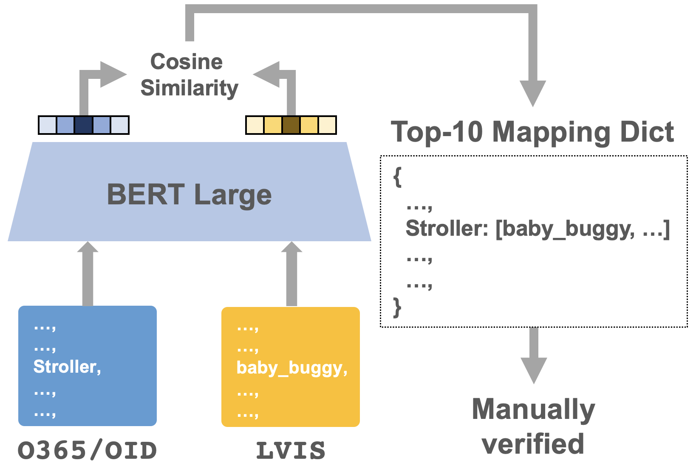

# BigDetection: A Large-scale Benchmark for Improved Object Detector Pre-training

By [Likun Cai](https://github.com/cailk), Zhi Zhang, Yi Zhu, Li Zhang, Mu Li, Xiangyang Xue.

<div align="center">
    
</div>

This repo is the official implementation of [BigDetection](http://arxiv.org/). It is based on [mmdetection](https://github.com/open-mmlab/mmdetection) and [CBNetV2](https://github.com/VDIGPKU/CBNetV2).

## Introduction
We construct a new large-scale benchmark termed *BigDetection*. Our goal is to simply leverage the training data from existing datasets ([LVIS](https://www.lvisdataset.org/), [OpenImages](https://storage.googleapis.com/openimages/web/index.html) and [Object365](https://www.objects365.org/overview.html)) with carefully designed principles, and curate a larger dataset for improved detector pre-training.


## Partial Results and Models

### BigDetection Pretrained Models
| Method | mAP (bigdet val) |Links |
| --- | :---: | :---: |
| YOLOv3 |  9.7 | [model](https://big-detection.s3.us-west-2.amazonaws.com/bigdet_cpts/mmdetection_cpts/yolov3_d53_bigdet_8x.pth)/[config](configs/BigDetection/yolov3/yolov3_d53_mstrain-608_8x_bigdet.py) |
| Deformable DETR | 13.1 | [model](https://big-detection.s3.us-west-2.amazonaws.com/bigdet_cpts/mmdetection_cpts/deformable_detr_bigdet_8x.pth)/[config](configs/BigDetection/deformable_detr/deformable_detr_r50_16x2_8x_bigdet.py) |
| CBNetV2 | 35.1 | [model](https://big-detection.s3.us-west-2.amazonaws.com/bigdet_cpts/mmdetection_cpts/htc_cbv2_swin_base_giou_4conv1f_bigdet.pth)/[config](configs/BigDetection/cbnetv2/htc_cbv2_swin_base_giou_4conv1f_adamw_bigdet.py) |

### CBNetV2 Finetuned on COCO
| Method | mAP (coco minival/test-dev) | Link |
| --- |  :---: | :---: |
| CBNetV2-Swin-B | 59.1/59.5 | [model](https://big-detection.s3.us-west-2.amazonaws.com/bigdet_cpts/mmdetection_cpts/htc_cbv2_swin_base_giou_4conv1f_bigdet_coco-ft_20e.pth)/[config](configs/BigDetection/cbnetv2/htc_cbv2_swin_base_giou_4conv1f_adamw_20e_coco.py) |
| CBNetV2-Swin-B (TTA) | 59.5/59.8 | [config (test only)](configs/BigDetection/cbnetv2/htc_cbv2_swin_base_giou_4conv1f_adamw_20e_coco_tta.py) |

### Notes
- `TTA` denotes test time augmentation.
- Pre-trained models of Swin Transformer can be downloaded from [Swin Transformer for ImageNet Classification](https://github.com/microsoft/Swin-Transformer).
- More results and models can be found in [model zoo](./model_zoo.md).

## Getting Started

### Requirements
- `Ubuntu 16.04`
- `CUDA 10.2`

### Installation
```
# Create conda environment
conda create -n bigdet python=3.7 -y
conda activate bigdet

# Install Pytorch
conda install pytorch==1.8.0 torchvision==0.9.0 cudatoolkit=10.2 -c pytorch

# Install mmcv
pip install mmcv-full==1.3.9 -f https://download.openmmlab.com/mmcv/dist/cu102/torch1.8.0/index.html

# Clone and install
git clone https://github.com/cailk/BigDetection-MMDet
cd BigDetection-MMDet
pip install -r requirements/build.txt
pip install -v -e .
```

### Data Preparation
Our BigDetection involves 3 datasets and train/val data can be downloaded from their official website ([Objects365](https://www.objects365.org/download.html), [OpenImages v6](https://storage.googleapis.com/openimages/web/download.html), [LVIS v1.0](https://www.lvisdataset.org/dataset)). All datasets should be placed under $bigdetection/data/ as below. The synsets (total 600 class names) of BigDetection dataset can be downloaded here: [bigdetection_synsets](https://drive.google.com/file/d/1XbzMia6NYmacIX60oU9h2xE99IkSI24F/view?usp=sharing). Contact us with [lkcai20@fudan.edu.cn](lkcai20@fudan.edu.cn) to get access to our pre-processed annotation files.
```
bigdetection/data
└── BigDetection
    ├── annotations
    │   ├── bigdet_obj_train.json
    │   ├── bigdet_oid_train.json
    │   ├── bigdet_lvis_train.json
    │   ├── bigdet_val.json
    │   └── cas_weights.json
    ├── train
    │   ├── Objects365
    │   ├── OpenImages
    │   └── LVIS
    └── val
```

### Inference
```
# single-gpu testing
python tools/test.py <CONFIG_FILE> <DET_CHECKPOINT_FILE> --eval bbox 

# multi-gpu testing
tools/dist_test.sh <CONFIG_FILE> <DET_CHECKPOINT_FILE> <GPU_NUM> --eval bbox
```

### Training

To train a detector with pre-trained models, run:
```
# multi-gpu training
tools/dist_train.sh <CONFIG_FILE> <GPU_NUM> 
```

### Apex
Following [Swin Transformer for Object Detection](https://github.com/SwinTransformer/Swin-Transformer-Object-Detection) and [CBNetV2](https://github.com/VDIGPKU/CBNetV2), we use apex for mixed precision training by default. To install apex, run:
```
git clone https://github.com/NVIDIA/apex
cd apex
pip install -v --disable-pip-version-check --no-cache-dir --global-option="--cpp_ext" --global-option="--cuda_ext" ./
```

## Citation
If you use our dataset for your research, please consider to cite the following paper.
```
@article{,
  title={BigDetection: A Large-scale Benchmark forImproved Object Detector Pre-training}, 
}
```

